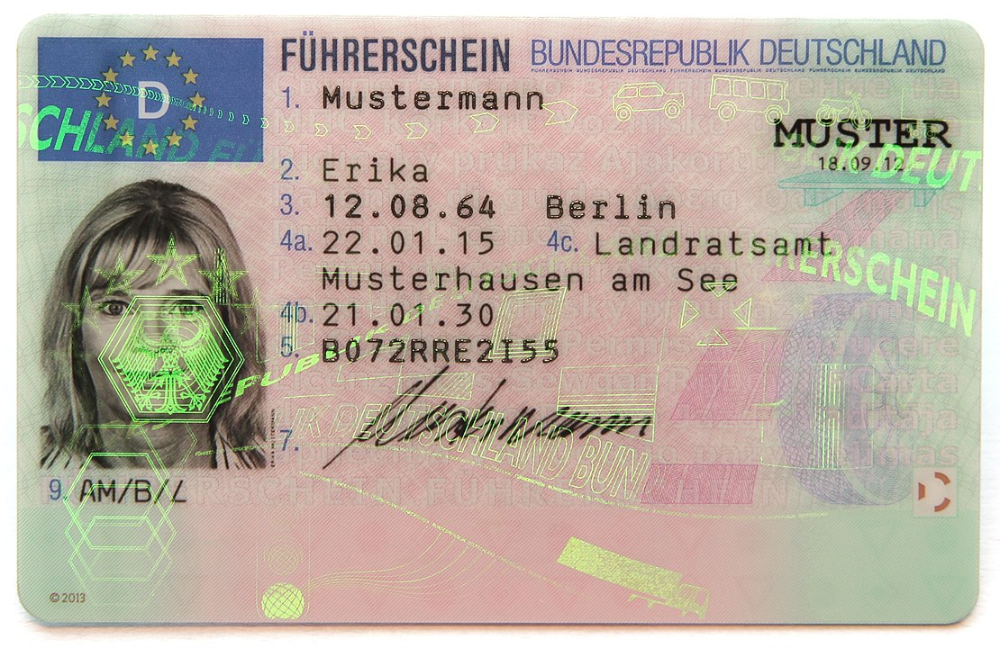

# watermark
Adds a visible watermark to images for personal privacy.

## Usage

```shell
python watermark.py --size 250 license.jpeg 'For Acme Bank 2021-10-20'
```

```
license.jpeg
```



```
watermark_license.jpeg
```


## Requirements
* Python 3
* [Imagemagick convert](https://imagemagick.org/script/download.php)
